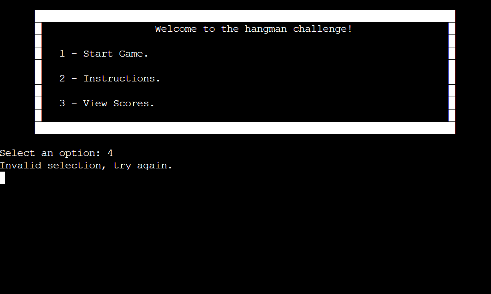
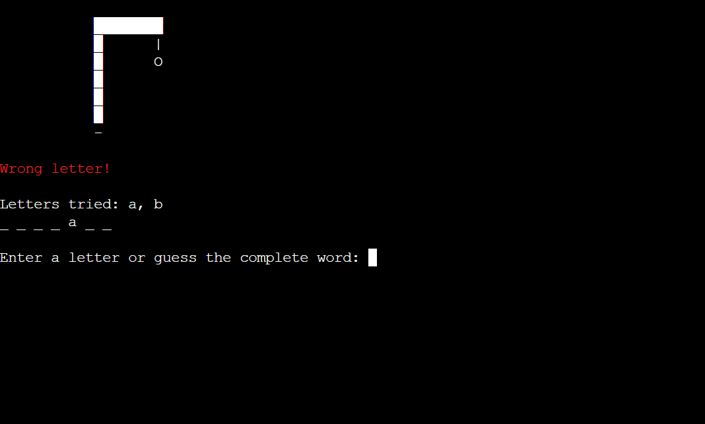

# Country Hangman

Country Hangman is a classic Python game where you can test your knowledge of geography. The game allows players to guess a hidden word, which is the name of a country. Each player has 6 attempts to guess the word correctly.

[Country Hangman](https://country-hangman-bf60eb61b898.herokuapp.com/)

## Project Overview:

As part of a course project, this game showcases many applications of Python development skills to create an interactive and fun experience. By utilizing the Google Cloud API and Google Sheets, the Python application interacts seamlessly with users and cloud services.

## How To Play:

The Hangman game is a very popular and old game, typically played with paper and pen in school, enjoyed by 2 or more people. The challenge of the game is to guess the hidden word. Initially, you'll see blanks representing each letter of the word, like this: _ _ _ _ _ _ _. Each time you guess a letter, it will either reveal that letter in the word or indicate that you've guessed incorrectly, gradually drawing a part of the hangman's body as your "life." If you guess the entire word correctly, you win the game. However, if the hangman is fully drawn before you guess the word, you lose. Additionally, remember that you have 1 minute to guess the word.

### Score System:

Implementing a score system is a great way to enhance the game and add an element of fun. With the score system, players can input their names and strive to reach the top of the leaderboard by performing their best in the game.

- For every correct letter guessed by the user, they will earn 10 points.

- For every incorrect letter guessed by the user, they will lose 5 points.

- In case you win the game, you will earn 50 points.

### Hint System:

The hint system is a way to help users guess the word, but before you ask for a hint, you need to have 15 points. If you have 15 points and you want to ask for a hint, it's simple: just type 'hint', and the terminal will input a letter.

## User Experience(UX):

- The goal of this program is to provide the user with a simple, easy-to-understand, and playable game of Hangman that can be enjoyed multiple times without repeating the same challenge.

1. Provide clear and concise instructions at the beginning of the game to guide the player on how to play. Use simple language and step-by-step explanations to ensure that even first-time visitors can understand how to navigate and enjoy the game.

2. Design an intuitive user interface that is easy to navigate and interact with. Use familiar symbols and layouts to guide the player through the game process, making it easy for them to input their guesses, request hints, and track their progress without feeling overwhelmed or confused.

3. Offer feedback and guidance throughout the game to keep the player engaged and informed. Provide immediate feedback when the player makes a guess, indicating whether it was correct or incorrect.

## Existing Features

### Main Menu 

- The main menu show the options available for the user.
- The options can be selected using the numbers 1 through 3.

### Invalid Input

- If the user enters any invalid input, a message will be displayed.

### Instructions 

- The instructions displays to the user how to play and explains the scoring system.

### View Scores

- Display the list of all scores, with the player who has the highest score at the top.

### The game

- Before the game begins, you need to type in your name.
- In case you don't input your name, it will prompt you to do so.

- The initial view of the game displays a message, allowing you to input a letter.

- If you type a wrong letter, a message is displayed in red, and a part of the body is drawn, starting with the head.

- If you type a correct letter, you will receive a green message and be prompted to input another letter.

- After earning 15 points, you can request a hint by typing 'hint'.

- If you win the game, a green message is displayed along with your score.

- If you lose the game, a red message is displayed along with your score.

- If the time is over, a red message is displayed along with your score.

## Flowchart

- For the development and logic decision maker has been draw a flowchart where show all user and system interaction flow.

## Test Table

| Expected Results | Result |
| :---------------------------------: | :------------------------------:|
| Be able to start the game when the user types 1 as input. | Pass |
| Only start the game after typing a name, or it will prompt you to do so. | Pass |
| Be able to read an instructions when users type 2 as input. | Pass |
| Be able to view the scores when the user types 3 as input. | Pass |
| Input invalid character. | Pass |
| Be able to request a hint only after earning 15 points. | Pass |
| Be able to guess the entire word.| Pass |
| See which letters I have already guessed. | Pass |
| This letter has already been tried. | Pass |
| Display incorrect letter and draw a part of the body. | Pass |
| Display the correct letter and show its position in the word. | Pass |
| The game is over after the drawing is fully completed. | Pass |
| Display the country and the score after finishing the game. | Pass |
| Every page has an option to press enter and return to the main menu. | Pass |
| After 1 minute, the time is up. | Pass |
| The score system is working. | Pass |
| Get a random country from Google Sheets. | Pass |
| Store the name and score in the Google Sheets. | Pass |

### Debugging

- [CI Python Linter - Code institute](https://pep8ci.herokuapp.com/)

## Technologies

- **Python:** Backend Development
- **Visual Studio Code:** Local IDE.
- **GitHub:** Source code hosting and deployment.
- **Git:** Version control.
- **Heroku:** Cloud Deployment.
- **Google Cloud Services** APIs to access and manipulate cloud based files
- **Google Drive** Store data in a googlesheet 
- **Google Sheet** Data Storage
- **Miro** Flowchart and design thinking

## Libraries

- **random** Used to generate random numbers or select random elements from a list.
- **gspread** Used to access Google Sheets documents throughout the application, allowing for data access and editing.
- **ServiceAccountCredentials** Used to provide service account credentials for authentication with the Google Sheets API.
- **os** Used to interact with the operating system.
- **time** Used to manipulate time-related functions, such as delays and measuring time intervals.

## Google Cloud

- To the data management strategy, use the Google Cloud robust APIs to store and manipulate data effeciently. Specifically, rely on two APIs provided by GoogleCloud:
    the Google Drive API and the Google Sheets API. These APIs empower us to seamlessly interact with data stored on Google Drive and within Google Sheets programmatically.
    To ensure the utmost privacy and security to the data, has been implemented a sophisticated approach using service accounts.

### Google Drive API

- The Google Drive API allows developers to interact with files and folders stored on Google Drive programmatically. It provides methods for uploading, downloading, searching, and modifying files, as well as managing permissions and metadata.

### Google Sheets API

- The Google Sheets API enables developers to read, write, and manipulate Google Sheets data using code. It allows for tasks such as creating new sheets, updating existing ones, inserting and deleting rows and columns, and formatting cells.

## Deployment

### Github Forking

- **Forking the GitHub Repository**
  - If you want to make changes to your repository without affecting it, you can make a copy of it by 'Forking' it. This ensures your original repository remains unchanged.

  1. Find the relevant GitHub repository
  2. In the top right corner of the page, click the Fork button (under your account)
  3. Your repository has now been 'Forked' and you have a copy to work on

- **Cloning the GitHub Repository**
  - Cloning your repository will allow you to download a local version of the repository to be worked on. Cloning can also be a great way to backup your work.

  1. Find the relevant GitHub repository
  2. Press the arrow on the Code button
  3. Copy the link that is shown in the drop-down
  4. Open the terminal 
  5. Move to the folder you want clone it
  6. In the terminal type 'git clone' & then paste the link you copied in GitHub
  7. Press enter and your local clone will be created.
- Live link: [GitHub Link](https://github.com/danijuniordev/country-hangman.git)

### Heroku Deployment

- **Creating Requirements.txt**
    - To heroku be able to install the required dependencies is necessary to create the file where will be listed what is needed to run the project.

    1. Create a file requirements.txt.
    2. Run the command: pip3 freeze >requirements.txt.
    3. Check if the file has been updated like the image bellow.

- **Creating an Application with Heroku**
    - To be able to  deploy and run the application on heroku plataform, is necessary follow a few steps:

    1. Login or create an account on Heroku website.
    2. Click on create a new app.

3. After create the new app, you need to configure the settings.
4. The first setting which need to be done is add your CREDS.json info to the plataform so it will be able to access the googlecloud service account.

5. Add the Buildpacks necessary to run the application, in this case python and nodejs in this sequence.

6. After done the settings we move to the deploy tab where we will configure the deployment setup.
7. Connect your Github.
8. Select your repository on github.
9. Connect to the repository.

10. After all setting above been done you can select to deploy automatic or manual.

11. After press to deploy your project if all settings are working you should see it building the application.

12. After all steps of deployment will show a button View, where you can click to open a new tab with the application.

## Credits

**Base Code reference** 
   - [Code institute Love Sandwiches Walkthrough](https://learn.codeinstitute.net/courses/course-v1:CodeInstitute+LS101+2021_T1/courseware/293ee9d8ff3542d3b877137ed81b9a5b/58d3e90f9a2043908c62f31e51c15deb/)
   - [P3-Hangman-Python-Terminal-Game](https://github.com/paulio11/P3-Hangman-Python-Terminal-Game.git)

**My mentor**
 - [Dick Vlaanderen](https://github.com/dickvla) 

 **Readme References**
- [Volnei Oee Calculator GitHub](https://github.com/Volneirj/oee-calculator.git)
- [CI-PP3_hangman](https://github.com/Kay-ddggxh/CI-PP3_hangman.git)