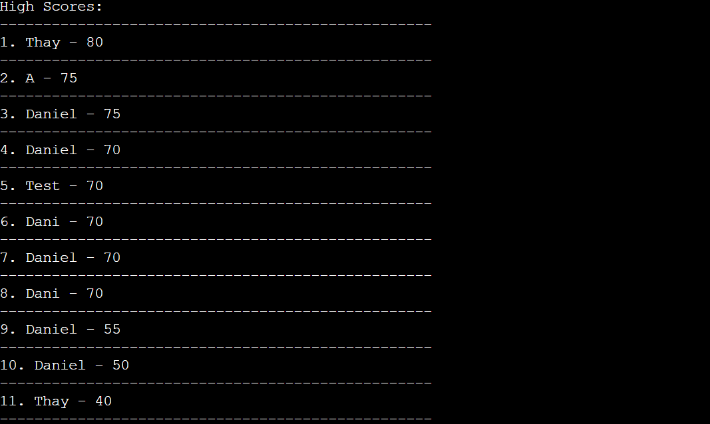
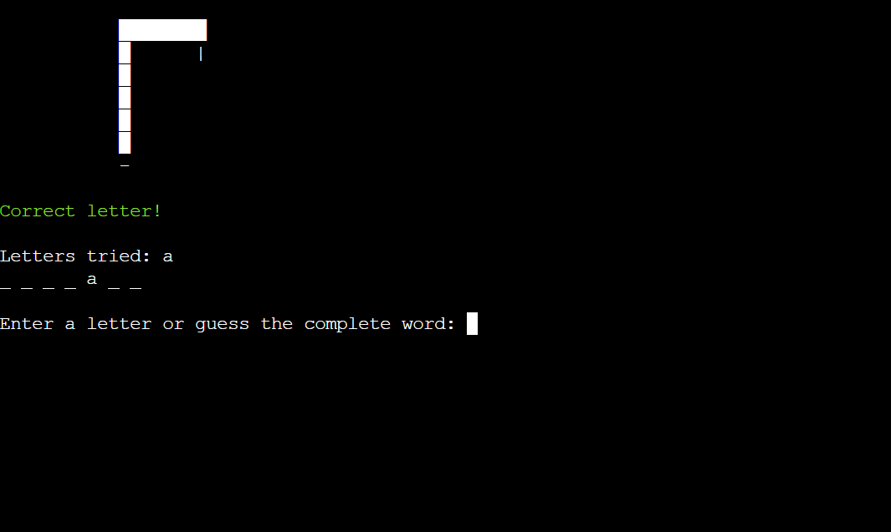

# Country Hangman

Country Hangman is a classic Python game where you can test your knowledge of geography. The game allows players to guess a hidden word, which is the name of a country. Each player has 6 attempts to guess the word correctly.

[Country Hangman](https://country-hangman-bf60eb61b898.herokuapp.com/)

## Project Overview:

As part of a course project, this game showcases many applications of Python development skills to create an interactive and fun experience. By utilizing the Google Cloud API and Google Sheets, the Python application interacts seamlessly with users and cloud services.

## How To Play:

The Hangman game is a very popular and old game, typically played with paper and pen in school, enjoyed by 2 or more people. The challenge of the game is to guess the hidden word. Initially, you'll see blanks representing each letter of the word, like this: _ _ _ _ _ _ _. Each time you guess a letter, it will either reveal that letter in the word or indicate that you've guessed incorrectly, gradually drawing a part of the hangman's body as your "life." If you guess the entire word correctly, you win the game. However, if the hangman is fully drawn before you guess the word, you lose. Additionally, remember that you have 1 minute to guess the word.

### Score System:

Implementing a score system is a great way to enhance the game and add an element of fun. With the score system, players can input their names and strive to reach the top of the leaderboard by performing their best in the game.

- For every correct letter guessed by the user, they will earn 10 points.

- For every incorrect letter guessed by the user, they will lose 5 points.

- In case you win the game, you will earn 50 points.

### Hint System:

The hint system is a way to help users guess the word, but before you ask for a hint, you need to have 15 points. If you have 15 points and you want to ask for a hint, it's simple: just type 'hint', and the terminal will input a letter.

## User Experience(UX):

- The goal of this program is to provide the user with a simple, easy-to-understand, and playable game of Hangman that can be enjoyed multiple times without repeating the same challenge.

1. Provide clear and concise instructions at the beginning of the game to guide the player on how to play. Use simple language and step-by-step explanations to ensure that even first-time visitors can understand how to navigate and enjoy the game.

2. Design an intuitive user interface that is easy to navigate and interact with. Use familiar symbols and layouts to guide the player through the game process, making it easy for them to input their guesses, request hints, and track their progress without feeling overwhelmed or confused.

3. Offer feedback and guidance throughout the game to keep the player engaged and informed. Provide immediate feedback when the player makes a guess, indicating whether it was correct or incorrect.

## Existing Features

### Main Menu 

- The main menu show the options available for the user.
- The options can be selected using the numbers 1 through 3.

### Introduction 

- The introduction displays to the user how to play and explains the scoring system.

### View Scores

- Display the list of all scores, with the player who has the highest score at the top.

### Invalid Input

- If the user enters any invalid input, a message will be displayed.

### The game

- Before the game begins, you need to type in your name.

- The initial view of the game displays a message, allowing you to input a letter.

- If you type a wrong letter, a message is displayed in red, and a part of the body is drawn, starting with the head.

- If you type a correct letter, you will receive a green message and be prompted to input another letter.

- After earning 15 points, you can request a hint by typing 'hint'.

- If you win the game, a green message is displayed along with your score.

- If you lose the game, a red message is displayed along with your score.

